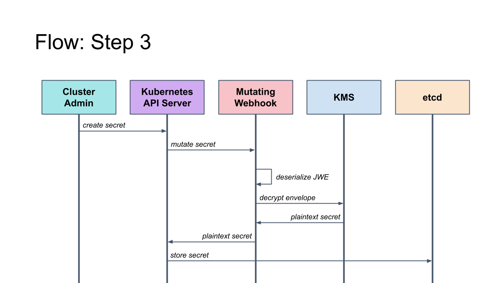

# Integrating management of K8S Secrets into GitOps workflow via a decryption webhook.

## Intro
GitOps (or operations by git commits), in the context of k8s, is the approach where a Git repository provides a source of truth for clusters’ configuration. Thus enabling facilities such as version control, history, peer review, and rollback of clusters’ configuration to happen through Git. The inclusion of K8S Secrets (and other security sensitive K8S resources) into GitOps workflows poses some challenges - we should not store secrets in clear text in Git (even if Git repo is private). This document outlines a strategy of how to securely store K8S Secrets in version control repositories such as Git.

## Personas
There are three personas involved in the below described workflows (though depending on the environment all of these personas may be manifested by a single user):
* KMS Manager - responsible for creating and managing crypto key resources in KMS 
* Secrets Custodian - manages sensitive data (passwords, api keys, etc). It is not assumed that Secrets Custodians have any relationship to cluster administration, nor are they familiar with Kubernetes tools. For example, an HR Oracle DBA (Secrets Custodian - owns passwords for HR database) who is asked to provide a password for k8s project.
* Cluster Administrator - deploys and manages k8s clusters.


## The Approach
This approach mimics the encrypted email workflow where senders encrypt messages using the public key of the recipient. Secure exchange of messages hinges on the use of a common standard for the serialization of encrypted/signed messages, so that the process is independent of email client/provider.

Three standards were reviewed and JSON Web Encryption ([JWE](https://tools.ietf.org/html/rfc7516)) appears to be the best fit for this scenario. For the analysis of reviewed standards and the rationale for the selection of JWE see appendix 3.

### Delegate decryption of confidential fields to KMS webhook
The responsibility of decrypting confidential fields within incoming requests for creating secrets will be delegated to a [mutating webhook](https://kubernetes.io/docs/reference/access-authn-authz/extensible-admission-controllers/). Such a webhook will expect that incoming secrets (specifically the confidential part) may have been encrypted outside Kubernetes (see example below).

```yaml
apiVersion: v1
kind: Secret
metadata:
  name: mysecret
  type: Opaque
Data:
  # encrypted value supplied by a Secret's Custodian
  dba-pwd: YWRt...snip...W4==
```

When the mutating webhook encounters a resource where confidential sections (values of a secret) are enveloped using JSON Web Encryption (JWE) serialization format, it will perform the following steps before passing it back to kube-apiserver:
1. Identify all confidential sections of the resource (this is explained in more detail in the next section).
2. For each section:
    - Unwrap the JWE envelope
    - Locate the encrypted_key (Key Encryption Key or KEK) member of the envelope.
    - Pass the encrypted_key to the Decrypt method of KMS-Plugin
    - Decrypt the payload via the key acquired in the previous step

At this point, the mutating webhook will have a “regular” secret object (no ciphertext values), which it returns to kube-apiserver. 
Assuming that the kube-apiserver is configured with a [KMS Provider](https://kubernetes.io/docs/tasks/administer-cluster/kms-provider/), upon reaching the Storage layer of kube-apiserver, this secret will be encrypted in full according to the supplied [Encryption Config](https://kubernetes.io/docs/tasks/administer-cluster/kms-provider/#encrypting-your-data-with-the-kms-provider).


 
### User Journey

1. **KMS Manager**
     - creates an asymmetric key pair (ex. RSA) in KMS/HSM (examples below use Google CloudKMS)
         ```shell script
        gcloud beta kms keys create [KEY_NAME] \
          --location [LOCATION] \
          --keyring [KEYRING_NAME] \
          --purpose ASYMMETRIC_DECRYPT \
          --default-algorithm rsa-decrypt-oaep-4096-sha256
        ```
     - retrieves the public key from the KMS/HSM
         ```shell script
        gcloud beta kms keys versions \
          get-public-key [CRYPTO_KEY_VERSION] \
          --location [LOCATION] \
          --keyring [KEY_RING] \
          --key [KEY_NAME] \
          --output-file ~/mykey.pub
        
        ```
      - places the public key into Git

2. **Secrets Custodian**
    - pulls the public created by KMS Manager from Git
    - create JWE envelope using the public key retrieved from Git
    ```shell script
    JWE=$(echo "P@ssw0rd" | jose-util encrypt --full \
      --key "/tmp/key.pub" --alg "RSA-OAEP-256" \
      --enc "A128CBC-HS256")
    
    cat > encrypted-secret-k8s.yaml <<EOF
    kind: Secret
    stringData:
      password: ${JWE}
    EOF
    ```
  - pushes the output (Compact JWE Serialization) to Git
3. **Cluster Administrator**
    - configure the mutating webhook for Secrets' decryption
    ```yaml
    apiVersion: admissionregistration.k8s.io/v1
    kind: MutatingWebhookConfiguration
    webhooks:
    - name: secrets-demo.kubecon-eu.info
      rules:
      - apiGroups: [""]
        apiVersions: ["v1"]
        operations: ["CREATE", "DELETE"]
        scope: "Namespaced"
      clientConfig:
        url: "https://jwe-webhook-farm.example.com/secrets"
        caBundle: Ls0tLs1CRUdJtiBDRVJUSUZJQ0FURS0t...
    ```

The next time when CI/CD pipeline runs the sealed secret will be added to the kube-apiserver and become available to applicatoins.
